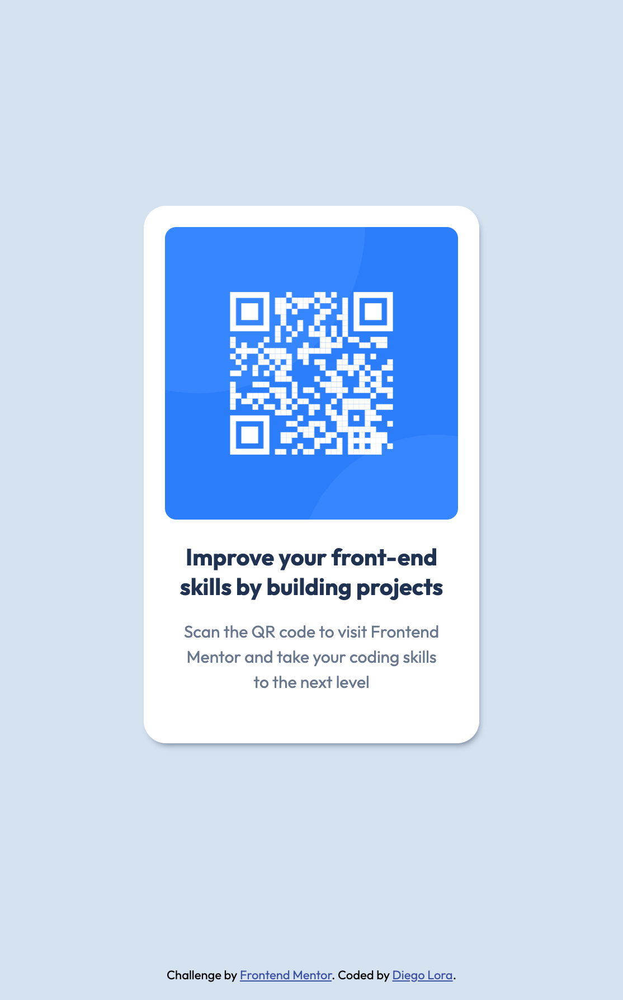

# Frontend Mentor - QR code component solution

This is a solution to the [QR code component challenge on Frontend Mentor](https://www.frontendmentor.io/challenges/qr-code-component-iux_sIO_H). Frontend Mentor challenges help you improve your coding skills by building realistic projects. 

## Table of contents

- [Overview](#overview)
  - [Screenshot](#screenshot)
  - [Links](#links)
- [My process](#my-process)
  - [Built with](#built-with)
  - [What I learned](#what-i-learned)
  - [Continued development](#continued-development)
  - [Useful resources](#useful-resources)
  - [AI Collaboration](#ai-collaboration)
- [Author](#author)

## Overview
Simple card component displaying the image of a QR Code.

### Screenshot



### Links

- Solution URL: [Add solution URL here](https://your-solution-url.com)
- Live Site URL: [Add live site URL here](https://your-live-site-url.com)

## My process

### Built with

- Semantic HTML5 markup
- CSS custom properties
- Flexbox
- Mobile-first workflow


### What I learned

article tag is better used for self-contained pieces of content that could stand alone, such as a blog post, a card or a product listing.
I could also used a div, but I prefered practice semantic tags.
I change br tag for span tags to avoid text wrapping when the card shrink.


```html
<h1>Some HTML code I'm proud of</h1>

 <article>
      
      <h1><span class="nowrap">Improve your front-end</span> <span class="nowrap">skills by building projects</span></h1>
      <p><span class="nowrap">Scan the QR code to visit Frontend</span> <span class="nowrap">Mentor and take your coding skills</span> <span class="nowrap">to the next level</span></p>
  </article>
```

```css
.nowrap {
    white-space: nowrap;
}
```

### Continued development

I want to keep practicing semantic tags and aria label, because I understand the concept, but I did not practice enough projects with more variety. Lets see on the coming projects how I can develop more intution.

### Useful resources

- [GitHub pages tutorial](https://www.youtube.com/watch?v=5XhxR9Vs6zc) - I'm a visual learner, so I used this tutorial to know how to deploy a simple website.
- [Git and GitHub tutorial](https://www.youtube.com/watch?v=mBYSUUnMt9M&t=4931s) - Resource in Spanish, you will learn how to clone, push and pull a repo. Begginer friendly and there is an overview of terminology and concepts in the first minutes.

### AI Collaboration

I am using Claude Code. Learn to hide the right panel using command + option + b. I prefer using its chat version in Claude app, it is more visually helpful. I ask about theory overview, the difference between using article, section and div tags. Explain me aria label, and asked for examples. Also I solicitud on chat for video link tutorials on accesibility. Generally, I used AI to ask for theory overview and examples that compare usages on tags.


## Author

- Frontend Mentor - [@yourusername](https://www.frontendmentor.io/profile/diegoloradigital)
- X - [@diego_lora_](https://x.com/diego_lora_)


